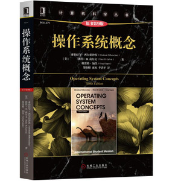
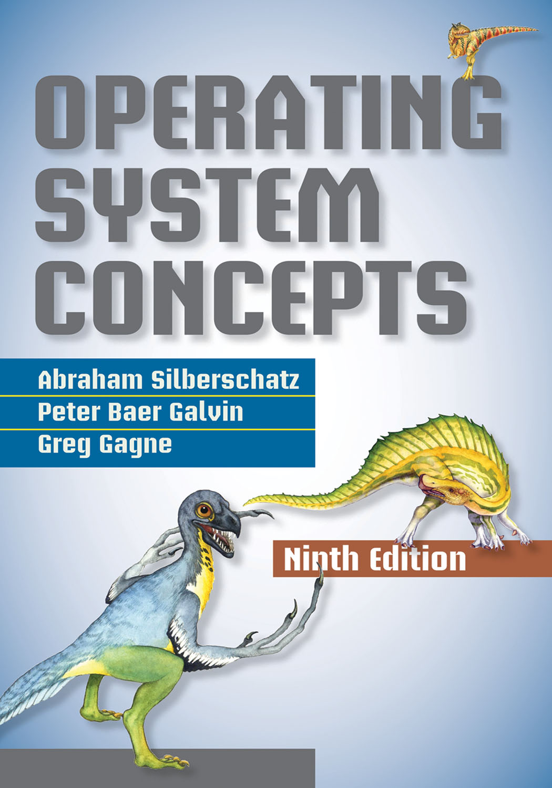

# WHU-Operating-System-Concepts
**WHU-武汉大学-操作系统概念-课程资料与习题解答**

School of Cyber science and technology  - 国家网络安全学院

- 关于教材：

  - 中文教材使用机械工业出版社黑皮书：《操作系统概念-国际版-9th》

  

  - 英文教材使用<Silberschatz Operating System Concepts-9th>

- 关于作业：
  - 两本教材的解答
  - 部分编程作业
  - 课程理论作业因老师而异，解答不提供

